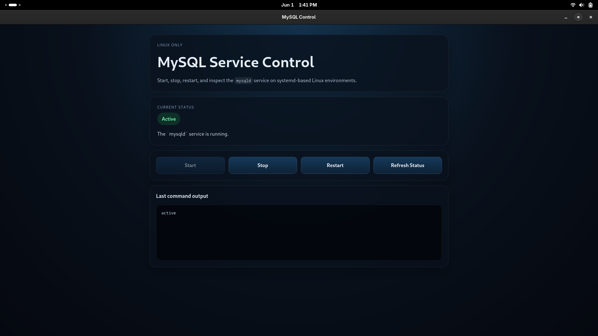

# MySQL Service Control

MySQL Service Control is a small Tauri desktop app for Linux that lets you start, stop, restart, and inspect the `mysqld` service from a simple UI.

This project is intentionally narrow. It is not a SQL client, it does not manage database users, and it does not send SQL queries to MySQL. It only controls the Linux service.

## Screenshot



## Features

- Check the current `mysqld` status
- Start the service
- Stop the service
- Restart the service
- Refresh the service state at any time
- Show command output and setup-related errors in the UI

## Quick Start

1. Make sure your machine uses Linux with `systemd`.
2. Confirm the MySQL service name is `mysqld`.
3. Add a restricted `sudoers` rule for `systemctl start|stop|restart mysqld`.
4. Validate the commands in the terminal.
5. Run the Tauri app.

## Requirements

- Linux with `systemd`
- A `mysqld` systemd unit available on the machine
- `sudo` installed
- A user account allowed to run the required `systemctl` commands without an interactive password prompt
- Node.js, Yarn, and Rust tooling for local development

## Sudoers Setup

Create a dedicated sudoers rule that only allows the required commands.

Run `visudo` and add a rule like this, replacing `youruser` with your Linux username:

```sudoers
youruser ALL=(root) NOPASSWD: /usr/bin/systemctl start mysqld, /usr/bin/systemctl stop mysqld, /usr/bin/systemctl restart mysqld
```

On some distributions, `systemctl` may live in a different path. Check it with:

```bash
which systemctl
```

After that, validate the rule before using the app:

```bash
sudo -n systemctl start mysqld
sudo -n systemctl stop mysqld
sudo -n systemctl restart mysqld
```

If those commands still ask for a password or fail with a sudo policy error, the app will not be able to perform service actions.

## How It Works

The Tauri backend runs a fixed set of Linux commands and sends the result back to the React frontend.

The current commands are:

- `systemctl is-active mysqld`
- `sudo -n systemctl start mysqld`
- `sudo -n systemctl stop mysqld`
- `sudo -n systemctl restart mysqld`

The `-n` flag keeps `sudo` non-interactive so the desktop app does not block on a password prompt.

## Security Model

The app does not execute arbitrary shell commands.

It only calls a fixed set of `systemctl` operations for `mysqld`. This keeps the scope intentionally narrow and easier to audit in an open-source setting.

## Development

Install dependencies:

```bash
yarn install
```

Run the frontend in development mode:

```bash
yarn dev
```

Run the Tauri desktop app:

```bash
yarn tauri dev
```

Build the frontend:

```bash
yarn build
```

Check the Rust backend:

```bash
cd src-tauri
cargo check
```

## Manual Testing

Use `docs/manual-testing.md` as the release checklist for Linux verification, sudoers validation, and screenshot capture.

## CI

The repository includes a basic GitHub Actions workflow that runs:

- `yarn build`
- `cargo check`

On Linux CI runners, the workflow installs the native GTK/GLib development packages required by Tauri before running `cargo check`.

## Troubleshooting

### `sudo: a password is required`

Your `sudoers` rule is missing, too broad, too narrow, or using the wrong `systemctl` path.

Check:

- the output of `which systemctl`
- the exact username in the sudoers entry
- whether `sudo -n systemctl restart mysqld` works in the terminal

### `Unit mysqld.service could not be found`

Your distribution may use a different unit name such as `mysql`.

Check available units with:

```bash
systemctl list-units --type=service | grep -E 'mysql|mysqld'
```

If your machine uses a different unit name, update the `SERVICE_NAME` constant in `src-tauri/src/main.rs` before building.

### `systemctl` is missing or not working

This app is only intended for systemd-based Linux environments.

If the machine does not use systemd, service control will not work.

### The app only shows status but actions fail

This usually means:

- `systemctl is-active mysqld` works without privilege
- but `sudo -n systemctl start|stop|restart mysqld` is not allowed yet

Re-check your sudoers configuration and validate the exact commands manually in the terminal.

### GitHub Actions fails on `cargo check`

If CI fails with errors about `glib-2.0`, `gobject-2.0`, or `gio-2.0`, the Linux runner is missing the native development libraries that Tauri needs.

The repository workflow installs these dependencies before running `cargo check`. If you create a custom workflow, make sure you install the same Linux packages there as well.

## Limitations

- Linux only
- systemd only
- Default target service is `mysqld`
- No runtime configuration for alternate unit names yet
- Requires passwordless sudo for service-changing actions

## License

MIT
